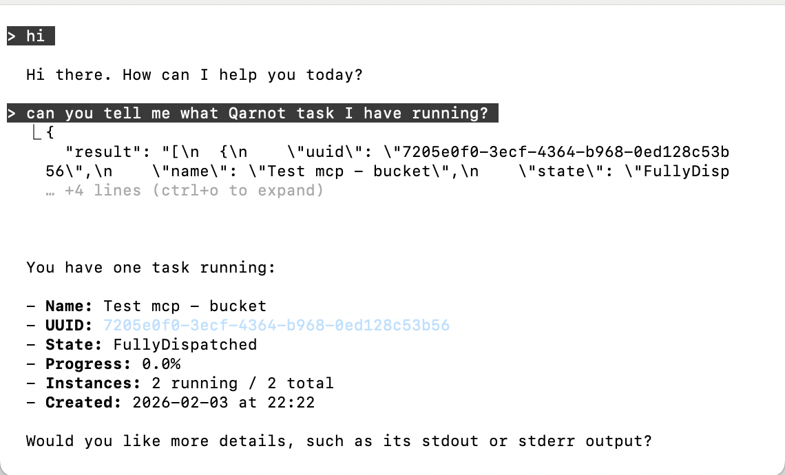

# Qarnot MCP Server

An MCP (Model Context Protocol) server that lets AI client (here, Claude) interact with your Qarnot tasks, using Anthropic MCP Python SDK. 
When you connect it to your AI assistant (Personal Chatbot, Claude, etc.), you can then interact with it naturally to retrieve informations about your task running on Qarnot (ex : What is the status of my last task?).



## What it does

Gives the client access to these tools:
- **list_tasks** - List all your Qarnot tasks
- **get_task_status** - Get detailed status + SSH connection info
- **get_task_stdout** - Get task output
- **get_task_stderr** - Get task errors
- **cancel_task** - Cancel a running task
- **list_buckets** - List all storage buckets
- **list_bucket_files** - List files in a bucket
- **download_result** - Download a file from a bucket

## Setup

1. Install dependencies:
   ```bash
   pip install qarnot "mcp[cli]" python-dotenv
   ```

2. Create a `.env` file with your Qarnot token:
   ```
   QARNOT_TOKEN="your-token-here"
   ```

## Usage

### With Claude Code (CLI)

To give Claude the abilities to use the tools from the MCP Server, you can : 

```bash
claude mcp add qarnot python3 /path/to/mcp_server.py
```

And restart Claude Code. You can then ask your requests (Ex : *"List my Qarnot tasks"*) to Claude. 

### Debugging or Manual test

```bash
mcp dev mcp_server.py
```

One can use the interactive MCP Inspector (https://modelcontextprotocol.io/docs/tools/inspector) to test their MCP Server.

### Tools definition

A tool is, in brief, an action that can be performed by the AI agent via the MCP. For example, "List tasks" is an action that can be performed by the agent if you ask it to list your current tasks.
To add a new tool, go to mcp_server.py and use the following format (here, an example with list_tasks):

```python
@mcp.tool() #the Anthropic decorator to create a MCP tool
def list_tasks() -> str: # name of the tool and expected output
    """List all Qarnot tasks for your account.""" #Docstring description, very important for the LLM 
    conn = get_connection() #Qarnot Python SDK related to the tool 
    tasks = conn.tasks() #Qarnot Python SDK related to the tool 

    #Any in-between actions should be added here

    result = [] #Empty format of the output
    for task in tasks: #Build the reponse
        result.append({
            "uuid": task.uuid,
            "name": task.name,
            "state": task.state,
        })

    import json 
    return json.dumps(result, indent=2) #Return JSON for the AI Agent that can then answer your query
